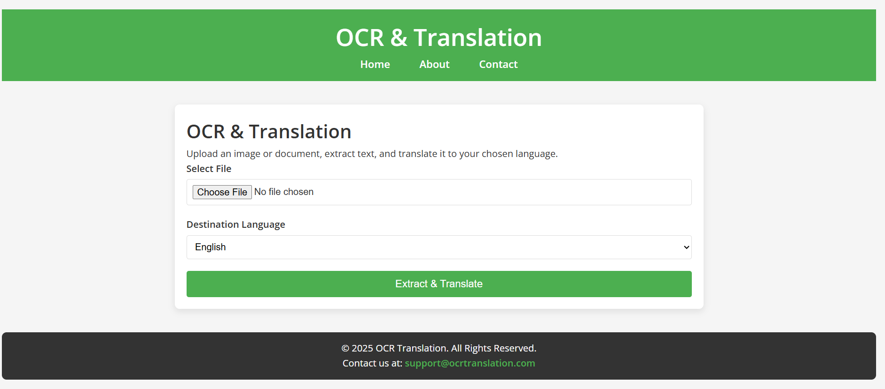
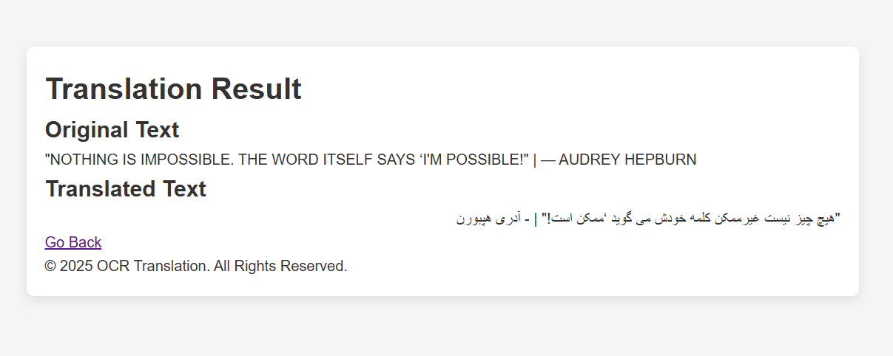

<!doctype html>
<html lang="en">
<head>
  <meta charset="utf-8" />
  <meta name="viewport" content="width=device-width,initial-scale=1" />
  <title>OCR &amp; Translation Web App — README</title>
  
</head>
<body>
  

    <header>
      

        
        
        
      

      <h1>OCR &amp; Translation Web App</h1>
      
A web-based OCR (Optical Character Recognition) and Translation tool that extracts text from files and translates it into a target language.

    </header>

    <section>
      <h2>About</h2>
      

        This application allows users to upload images, PDF files, or DOCX documents, extract text using Tesseract OCR, and translate the extracted text using Google Translate (via <code>googletrans</code>).
      

      
<strong>Note:</strong> In this version, the app works best for images containing English text. Support for more languages and additional document types will be added in future releases.

    </section>

    <section>
      <h2>Features</h2>
      <ul>
        <li>Extract text from images (<code>.png</code>, <code>.jpg</code>, <code>.jpeg</code>)</li>
        <li>Extract text from PDF files</li>
        <li>Extract text from DOCX files</li>
        <li>Translate extracted text into a chosen target language</li>
        <li>Simple web interface for uploading files and viewing results</li>
        <li>Lightweight and easy to deploy</li>
      </ul>
    </section>

    <section class="project-structure">
      <h2>Project Structure</h2>
      <pre>
.
├── app.py                  # Main Flask app
├── utils/
│   ├── ocr_utils.py        # OCR extraction logic
│   ├── translate_utils.py  # Translation helper
├── templates/
│   ├── index.html          # Upload page
│   ├── result.html         # Result page
├── uploads/                # Temporary storage for uploaded files
├── requirements.txt        # Python dependencies
└── README.md               # Project documentation
      </pre>
    </section>

    <section>
      <h2>Installation</h2>

      <ol>
        <li>
          <strong>Clone the repository</strong>
          <pre><code>git clone https://github.com/yourusername/ocr-translate-app.git
cd ocr-translate-app</code></pre>
        </li>

        <li>
          <strong>Create a virtual environment (recommended)</strong>
          <pre><code>python -m venv venv
# Linux / macOS
source venv/bin/activate
# Windows (PowerShell)
venv\Scripts\Activate.ps1
# Windows (cmd)
venv\Scripts\activate</code></pre>
        </li>

        <li>
          <strong>Install dependencies</strong>
          <pre><code>pip install -r requirements.txt</code></pre>
        </li>

        <li>
          <strong>Install Tesseract OCR</strong>
          
Install the Tesseract engine for your platform:

          <ul>
            <li><strong>Ubuntu / Debian</strong>
              <pre><code>sudo apt install tesseract-ocr</code></pre>
            </li>
            <li><strong>macOS (Homebrew)</strong>
              <pre><code>brew install tesseract</code></pre>
            </li>
            <li><strong>Windows</strong>
              
Download the installer from the UB Mannheim build and add the Tesseract binary to your PATH.

            </li>
          </ul>
        </li>
      </ol>
    </section>

    <section>
      <h2>Usage</h2>
      
Start the Flask server and open the application in your browser:

      <pre><code>python app.py</code></pre>
      
Open your browser and go to <code>http://127.0.0.1:5000</code>. Upload a file, choose the target language, and view the extracted and translated text.

    </section>

    <section>
      <h2>Requirements</h2>
      
The following packages are required. Save these into <code>requirements.txt</code> (or use the one included in the repo):

      <pre><code>fastapi
uvicorn
pytesseract
pdf2image
Pillow
python-docx
googletrans==4.0.0-rc1
jinja2
python-multipart
Flask</code></pre>
    </section>

    <section>
      <h2>Demo</h2>
      
Place screenshots in <code>docs/screenshots/</code>. Example image references:

      

        

          <figure>
            
            <figcaption style="color:var(--muted);font-size:13px;margin-top:6px;">Upload page (placeholder)</figcaption>
          </figure>
        

        

          <figure>
            
            <figcaption style="color:var(--muted);font-size:13px;margin-top:6px;">Result page (placeholder)</figcaption>
          </figure>
        

      

    </section>

    <section>
      <h2>Future Improvements</h2>
      <ul>
        <li>Improve multilingual OCR support (better accuracy for non-English text)</li>
        <li>Add support for additional formats such as <code>.txt</code> and <code>.pptx</code></li>
        <li>Enable batch file uploads</li>
        <li>Provide a Dockerfile and docker-compose setup for easy deployment</li>
        <li>Create an API version using FastAPI for programmatic access</li>
      </ul>
    </section>

    <section>
      <h2>Author</h2>
      
Yasaman Afshar Ghasemloo

    </section>

    <section>
      <h2>License</h2>
      
This project is available under the <a href="#" title="Add your license link">MIT License</a> (or choose another license). Add a <code>LICENSE</code> file to the repository with the full license text.

    </section>

    <footer>
      
Generated README — save as <code>README.html</code> or copy the content into your preferred README format.

    </footer>
  

</body>
</html>
